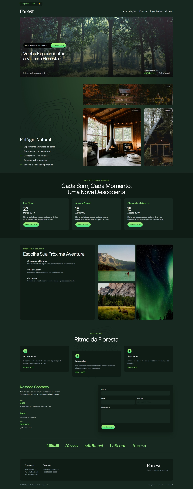

# Projeto Final - Tailwind CSS (Origamid) 🚀



> 🔗 **[Clique aqui para ver o projeto rodando ao vivo](COLE-AQUI-O-LINK-DO-GITHUB-PAGES)**

## 💻 Sobre o Projeto

Este projeto foi desenvolvido como trabalho final do curso completo de **Tailwind CSS** da [Origamid](https://www.origamid.com/). O objetivo principal foi consolidar os conceitos de construção de interfaces modernas, responsivas e escaláveis utilizando o framework.

**Destaque Técnico:** O projeto foi desenvolvido inicialmente utilizando o **Tailwind CSS v3** e, posteriormente, **refatorado e migrado para o Tailwind v4**. Essa transição permitiu explorar na prática as novas melhorias de sintaxe, performance e a nova arquitetura do framework.

## 🛠️ Tecnologias Utilizadas

* **HTML5:** Semântica e acessibilidade.
* **CSS3:** Estilização base.
* **Tailwind CSS (v4):** Framework utilitário para estilização ágil e responsiva.
* **JavaScript (ES6):** Interatividade do menu mobile e animações.

## ✨ Principais Funcionalidades Implementadas

* **Design 100% Responsivo:** Adaptação fluida para Mobile, Tablet e Desktop.
* **Mobile-First:** Abordagem focada primeiramente na experiência mobile.
* **Menu Mobile (Hamburger):** Navegação interativa desenvolvida do zero.
* **Animações e Transições:** Utilização das classes utilitárias do Tailwind para feedback visual suave e animações de entrada.
* **Componentização (Apply):** Estruturação inteligente utilizando a diretiva `@apply` para componentes reutilizáveis.
* **Tipografia Avançada:** Configuração e customização de fontes diretamente pelo framework.

## 🚀 Como executar o projeto localmente

1. Clone este repositório:
   ```bash
   git clone https://github.com/brunosantosdesign/projeto-final-tailwind-origamid.git
